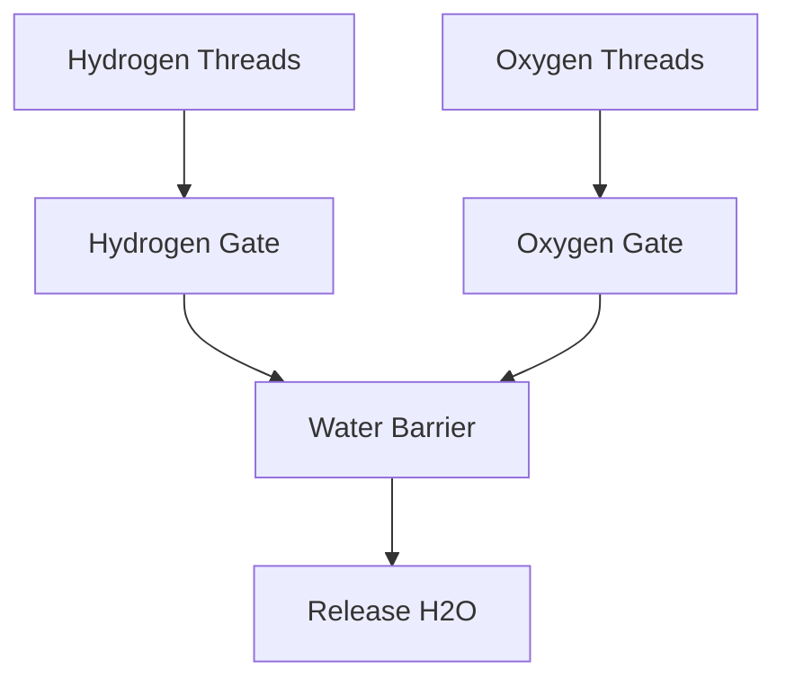

# System Design Thinking: Building H2O

This concurrency challenge involves coordinating two types of threads (Hydrogen and Oxygen) to form a water molecule ($H_2O$).

## 1. Requirements

### Functional Requirements
- `hydrogen()`: Should wait until it can form a molecule with another hydrogen and an oxygen thread.
- `oxygen()`: Should wait until two hydrogen threads arrive.
- **Constraints**: For every three threads that pass through the barrier, they must consist of exactly two $H$ and one $O$.

## 2. Key Concepts

### Barriers
- A **Barrier** is a synchronization primitive that stops multiple threads until a fixed number of them have arrived.
- In this case, we need a barrier of size 3 (2 Hydrogen + 1 Oxygen).

### Semaphores
- **Semaphores** can be used to control the number of "permits" available for each type of thread.
- We can have a semaphore for Hydrogen with 2 permits and a semaphore for Oxygen with 1 permit.

## 3. High-Level Architecture

1. **Gatekeeping**: Use semaphores or mutexes to ensure only 2 H and 1 O are "ready" to form a molecule at any time.
2. **Barrier**: Once the correct number of threads have arrived, they are released together to form the molecule.
3. **Reset**: Reset the state (or refill the semaphores) to allow the next set of threads to proceed.

## 4. Rust Implementation (Educational)

In the `mod.rs` file, you will implement this using common Rust synchronization primitives.

### Key Concepts to Practice:
- `std::sync::Barrier`: To group exactly 3 threads.
- `std::sync::Semaphore` (available via the `std::sync` module in some contexts or simulated with `Mutex`/`Condvar`): To control the $2H:1O$ ratio.
- `Mutex<i32>` and `Condvar` to manually manage the count of arriving threads.
