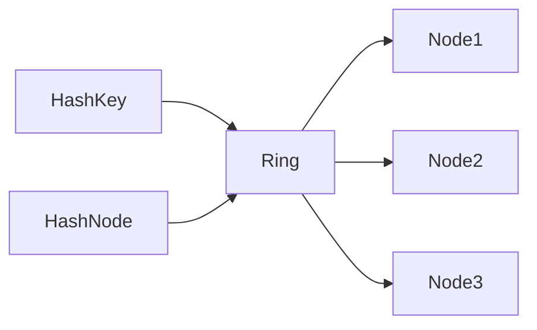

# System Design Thinking: Consistent Hashing

Consistent hashing is a fundamental technique in distributed systems to distribute data across multiple nodes. It minimizes the amount of data that needs to be moved when nodes are added or removed (re-sharding).

## 1. Requirements

### Functional Requirements
- Map keys to a specific node in a cluster.
- Add nodes to the cluster.
- Remove nodes from the cluster.
- Minimize data movement during re-sharding.

### Non-Functional Requirements
- **Scalability**: Handle an increasing number of nodes.
- **Fairness**: Distribute keys evenly across nodes (uniform distribution).

## 2. Key Concepts

### The Hashing Ring
- Map the entire hash space (e.g., $0$ to $2^{32}-1$) onto a circle or ring.
- Both nodes and keys are hashed to positions on this ring.
- To find a node for a key:
    1. Hash the key to find its position on the ring.
    2. Traverse the ring clockwise until you find the first node.

### Virtual Nodes (vnodes)
- **The Problem**: With only a few physical nodes, the distribution of keys can be uneven (some nodes get much more data than others).
- **The Solution**: Map each physical node to multiple "virtual nodes" on the ring.
- **Benefits**: Better load balancing and more even distribution.

## 3. Operations

### Adding a Node
- When a new node is added, only a small fraction of keys (those between the new node and its counter-clockwise neighbor) need to be re-sharded to the new node.

### Removing a Node
- When a node is removed, only its keys are re-sharded to its clockwise neighbor.

## 4. High-Level Architecture

1. **Placement**: Map nodes (using IP or ID) to the ring.
2. **Lookup**: Hash the key, find its position, and walk clockwise.
3. **Re-balancing**: Only affected segments of the ring are moved.

## 5. Rust Implementation (Educational)

In the `mod.rs` file, you will implement a **basic consistent hashing ring with virtual nodes**.

### Key Concepts to Practice:
- `BTreeMap` to represent the sorted positions on the ring.
- Hashing strings using `std::collections::hash_map::DefaultHasher` or a more stable hash like `MurmurHash`.
- Finding the "next" node using the `range` or `split_off` methods of `BTreeMap`.
