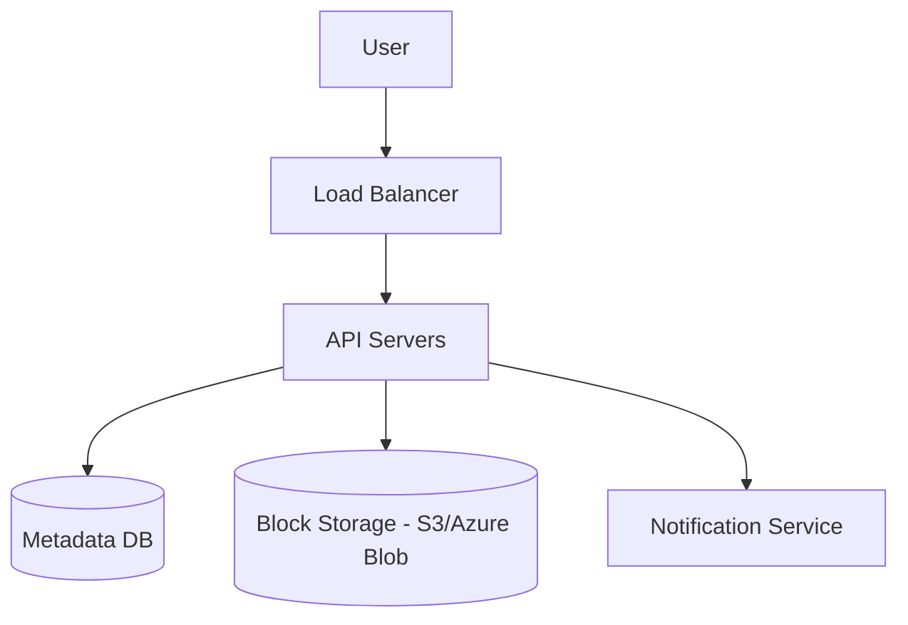

# System Design Thinking: Google Drive (Distributed Storage System)

A distributed storage system like Google Drive allows users to store, share, and synchronize files across multiple devices. Designing such a system requires careful consideration of data durability, scalability, and synchronization logic.

## 1. Requirements

### Functional Requirements
- **Upload/Download Files**: Users can upload and retrieve files.
- **File Sync**: Automatically synchronize files across all user devices.
- **File Revision History**: Keep multiple versions of a file (versioning).
- **Sharing**: Allow users to share files and folders with others.

### Non-Functional Requirements
- **Reliability (Durability)**: Data should not be lost.
- **Scalability**: Handle trillions of files and millions of users.
- **Low Latency**: Fast file uploads and downloads.
- **High Availability**: System should be accessible even if some servers are down.

## 2. API Design

```rust
pub trait StorageSystem {
    /// Uploads a file (or a file chunk).
    fn upload(&mut self, file_id: &str, content: Vec<u8>);
    
    /// Retrieves a file's content.
    fn download(&self, file_id: &str) -> Option<Vec<u8>>;
}
```

## 3. High-Level Architecture



1. **Metadata DB**: Stores file metadata (name, size, permissions, chunk list, versioning info).
2. **Block Storage**: Stores the actual file content as binary blobs.
3. **Notification Service**: Notifies other devices when a file is updated (Push or Long Polling).

## 4. Key Design Decisions

### Block-Level Storage
- Large files are split into small **chunks** (e.g., 4MB).
- **Benefits**:
    - **Resume Uploads**: If an upload fails, only the missing chunks need to be re-sent.
    - **Delta Updates**: When a file is modified, only the changed chunks are uploaded.
    - **Deduplication**: Identical chunks (even from different files) only need to be stored once.

### File Synchronization
- When a client updates a file:
    1. Send the modified chunks to the server.
    2. Server updates the metadata and notifies other devices.
    3. Other devices download only the modified chunks.

### Conflict Resolution
- If two users modify the same file simultaneously, the system must decide which version to keep (e.g., "last write wins" or creating a conflict version).

## 5. Rust Implementation (Educational)

In the `mod.rs` file, you will implement a **simple block-level storage manager**.

### Key Concepts to Practice:
- Chunking a byte vector into blocks.
- Using a `HashMap` to map `file_id` to a list of `chunk_ids`.
- Implementing a simple versioning mechanism.
