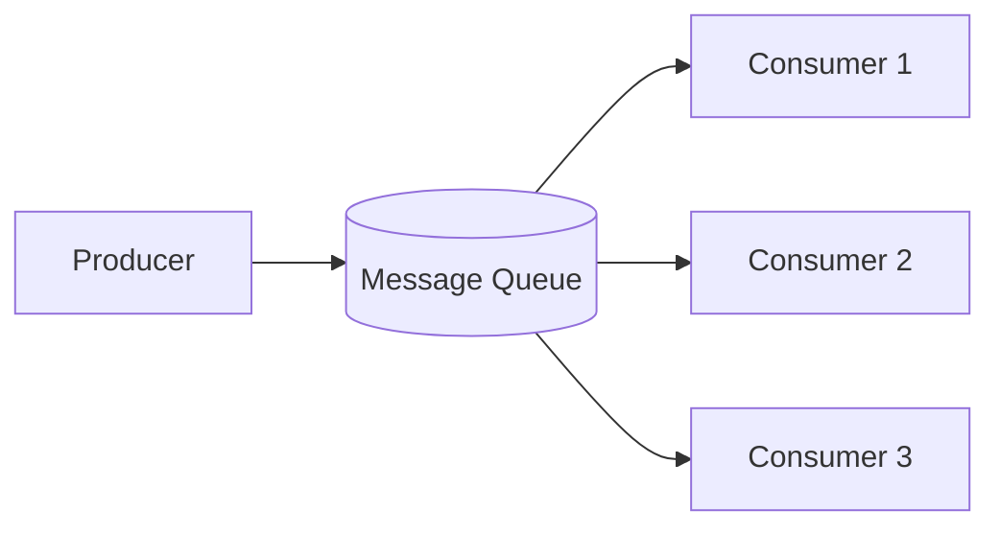

# System Design Thinking: Message Queue

A message queue is a form of asynchronous service-to-service communication used in serverless and microservices architectures. It enables services to communicate by sending messages to each other via an intermediary.

## 1. Requirements

### Functional Requirements
- **Produce**: Allow services to send messages to a specific queue or topic.
- **Consume**: Allow services to pull messages from a queue for processing.
- **Acknowledge (Ack)**: Ensure that a message is successfully processed before being removed from the queue.
- **Persistence**: Messages should be stored on disk to survive service restarts.

### Non-Functional Requirements
- **Scalability**: Handle high throughput of message production and consumption.
- **Decoupling**: The producer and consumer should be independent of each other.
- **Reliability**: Ensure "at-least-once" or "exactly-once" delivery semantics.
- **Low Latency**: Minimize the time between message production and availability for consumption.

## 2. Key Concepts

### Producer, Consumer, and Broker
- **Producer**: The service that creates and sends messages.
- **Consumer**: The service that retrieves and processes messages.
- **Broker**: The intermediary that manages the queues and message distribution.

### Messaging Models
- **Point-to-Point (Queue)**: Each message is consumed by exactly one consumer.
- **Publish-Subscribe (Topic)**: Each message can be consumed by multiple subscribers who are interested in the topic.

### Delivery Semantics
- **At-most-once**: Messages may be lost but never redelivered.
- **At-least-once**: Messages are never lost but may be redelivered. (Most common)
- **Exactly-once**: Messages are never lost and never redelivered. (Hardest to achieve)

## 3. High-Level Architecture

1. **Ingestion**: Producer sends a message to the broker.
2. **Storage**: Broker persists the message in a queue (often on disk).
3. **Distribution**: Broker delivers the message to one or more consumers (push or pull).
4. **Acknowledgement**: Consumer sends an `ack` after successful processing.

## 4. Key Design Decisions

### Push vs. Pull
- **Push**: Broker pushes messages to consumers as soon as they are available. Better for low latency but can overwhelm slow consumers.
- **Pull**: Consumers request messages when they have the capacity to process them. Better for load balancing.

### Message Persistence
- Use a **Log-based storage** (like Kafka) or an **In-memory queue with disk backup** (like RabbitMQ) to ensure durability.

## 5. Rust Implementation (Educational)

In the `mod.rs` file, you will implement a **simple in-memory message queue** with producer and consumer support.

### Key Concepts to Practice:
- `VecDeque` for the internal message storage.
- Using `std::sync::mpsc` or `crossbeam` channels for asynchronous communication.
- Implementing a simple `Ack` mechanism to prevent message loss.
