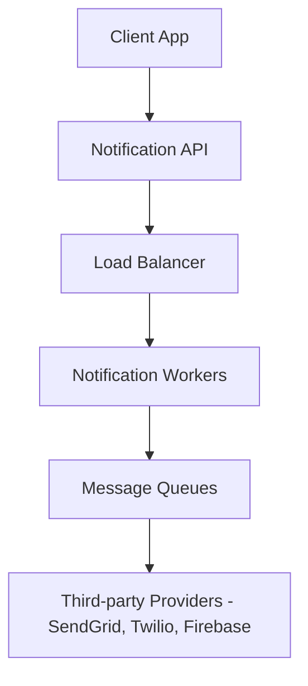

# System Design Thinking: Notification System

A notification system is a critical component for many applications, used to send alerts, updates, and reminders to users through various channels (Email, SMS, Push).

## 1. Requirements

### Functional Requirements
- Support multiple notification types: Push, SMS, Email.
- Real-time or near real-time delivery.
- Support multiple devices for a single user.

### Non-Functional Requirements
- **Scalability**: Send millions of notifications daily.
- **Reliability**: Minimal data loss (guaranteed delivery if possible).
- **Extensibility**: Easy to add new notification channels.
- **Rate Limiting**: Prevent overwhelming users with too many notifications.

## 2. API Design

```rust
pub trait NotificationProvider {
    fn send(&self, user_id: &str, message: &str);
}

pub struct NotificationService {
    providers: HashMap<String, Box<dyn NotificationProvider>>,
}
```

## 3. High-Level Architecture



1. **API Service**: Receives notification requests from various services.
2. **Message Queues**: Decouple the API from the actual delivery process. If a third-party provider is down, the message stays in the queue.
3. **Workers**: Pull messages from the queue and send them via the appropriate third-party provider.
4. **Third-party Providers**: Responsible for the final delivery (e.g., SendGrid for Email, Twilio for SMS).

## 4. Key Design Decisions

### Reliability (Retry Mechanism)
- If a notification fails to send, it should be put back into a "retry queue."
- Use **Exponential Backoff** to avoid overwhelming the provider.

### Message Deduplication
- Use a `notification_id` or `deduplication_key` to ensure that the same notification isn't sent multiple times due to retries or network issues.

### User Preferences
- Store user settings for each notification type (e.g., "Mute SMS for marketing").

## 5. Rust Implementation (Educational)

In the `mod.rs` file, you will implement a **simplified notification service** with multiple provider support.

### Key Concepts to Practice:
- **Traits** and **Dynamic Dispatch** for different providers.
- **Mocking** a message queue using a `Vec` or `VecDeque`.
- Handling errors and simulating retries.
