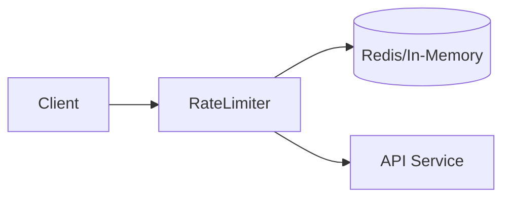

# System Design Thinking: Rate Limiter

A rate limiter is used to control the rate of traffic sent by a client or a service. In the distributed system, a rate limiter is used to decide whether the incoming request is allowed or should be throttled.

## 1. Requirements

### Functional Requirements
- Limit the number of requests a client can send to an API within a specific time window.
- The rate limiter should support multiple rate-limiting algorithms (Token Bucket, Leaky Bucket, Fixed Window, etc.).
- Inform the client when they are throttled (e.g., HTTP 429 Too Many Requests).

### Non-Functional Requirements
- **Low Latency**: The rate limiter should not add significant delay to the requests.
- **Accuracy**: The rate limiting should be as accurate as possible across multiple instances.
- **Scalability**: The rate limiter should be able to handle a high volume of requests.
- **High Availability**: The rate limiter should be fault-tolerant.

## 2. API Design

```rust
// Basic interface for a Rate Limiter
pub trait RateLimiter {
    /// Returns true if the request is allowed, false otherwise.
    fn allow_request(&mut self, client_id: &str) -> bool;
}
```

## 3. High-Level Architecture



1. **Client Sends Request**: The request hits the rate limiter middleware.
2. **Rate Limiter Checks Cache**: The rate limiter retrieves the current count/token for the `client_id` from a fast cache (e.g., Redis).
3. **Decision**:
    - If the request is within the limit, the counter is updated and the request is forwarded to the backend.
    - If the limit is exceeded, a 429 error is returned.

## 4. Algorithms Deep Dive

### Token Bucket
- **Concept**: A bucket with a fixed capacity. Tokens are added at a constant rate. Each request consumes one token.
- **Pros**: Allows for bursts of traffic. Simple to implement.
- **Cons**: Can be tricky to tune the bucket size and refill rate.

### Leaky Bucket
- **Concept**: Requests enter a bucket (queue) and are processed at a fixed rate. If the bucket is full, new requests are discarded.
- **Pros**: Smoothes out traffic bursts. Fixed output rate.
- **Cons**: If there's a burst, older requests might be delayed significantly.

## 5. Rust Implementation (Educational)

In the `mod.rs` file, you will implement the **Token Bucket** algorithm using Rust's memory safety and concurrency primitives.

### Key Concepts to Practice:
- `HashMap` for storing client states.
- `std::time::Instant` for tracking time.
- `Mutex` or `RwLock` for thread-safe access (if shared).
