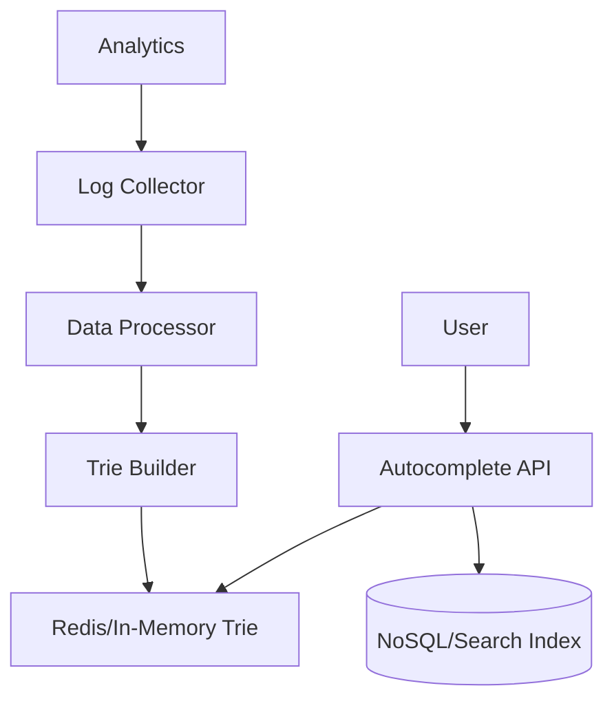

# System Design Thinking: Search Autocomplete

A search autocomplete system provides suggestions as a user types into a search box. It's a critical feature for search engines, e-commerce sites, and many other applications.

## 1. Requirements

### Functional Requirements
- **Suggestions**: Provide the top $k$ most frequent search terms that match the prefix typed by the user.
- **Real-time Updates**: The system should update its suggestions as the user types.

### Non-Functional Requirements
- **Low Latency**: Suggestions should appear in less than 100ms.
- **Scalability**: Handle thousands of queries per second.
- **High Availability**: The system should remain operational even if some components fail.
- **Relevance**: Suggestions should be popular and relevant to the user's input.

## 2. API Design

```rust
pub trait AutocompleteSystem {
    /// Inserts a search term with its frequency.
    fn insert(&mut self, term: String, frequency: u32);
    
    /// Returns the top k suggestions for the given prefix.
    fn get_suggestions(&self, prefix: &str, k: usize) -> Vec<String>;
}
```

## 3. High-Level Architecture



1. **Query Path**: API receives a prefix -> checks the Trie in memory/cache -> returns top $k$ results.
2. **Data Path**: Analytics collect user searches -> periodically process data -> update the Trie with new terms and frequencies.

## 4. Key Design Decisions

### Data Structure: Trie
- A **Trie (Prefix Tree)** is the ideal data structure for storing and searching prefixes.
- Each node in the Trie represents a character.
- To find suggestions:
    1. Navigate to the node representing the prefix.
    2. Traverse all child nodes to find all terms starting with that prefix.
    3. Sort the terms by frequency and pick the top $k$.

### Optimization: Pre-computation
- Traversing all child nodes can be slow for popular prefixes.
- **Solution**: Store the top $k$ suggestions directly in each Trie node. This allows for $O(L)$ lookup time, where $L$ is the length of the prefix.

### Frequency Updates
- Rebuilding the Trie in real-time is expensive.
- **Solution**: Update the Trie asynchronously (e.g., once an hour or day) based on collected search logs.

## 5. Rust Implementation (Educational)

In the `mod.rs` file, you will implement a **basic Trie-based autocomplete system**.

### Key Concepts to Practice:
- Building a Trie using recursive or iterative approaches.
- Using `HashMap` or a fixed-size array for Trie nodes.
- Sorting results based on frequency and lexicographical order.
