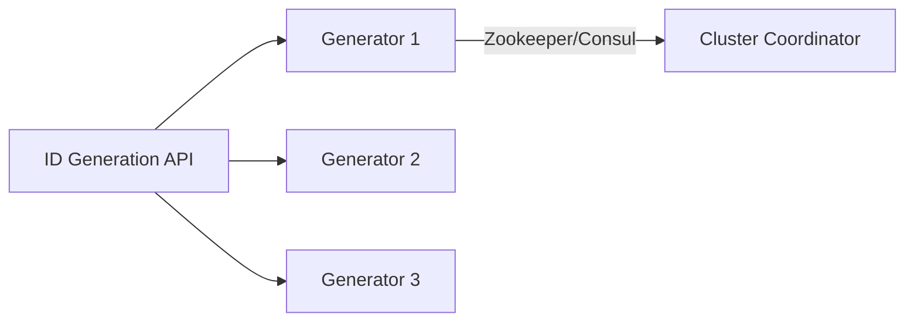

# System Design Thinking: Unique ID Generator

In distributed systems, we often need to generate unique, sortable, and scalable IDs for records (e.g., tweet IDs, order IDs). A common challenge is generating these IDs without a single point of failure (SPOF).

## 1. Requirements

### Functional Requirements
- Generate unique 64-bit IDs.
- IDs should be roughly sortable by time.
- The system should be able to generate millions of IDs per second.

### Non-Functional Requirements
- **Scalability**: Handle an increasing number of ID requests by adding more generators.
- **High Availability**: The system should not have a single point of failure.
- **No Duplicates**: Ensure no two IDs are identical across the entire system.

## 2. Approaches

### Database Auto-increment
- **Pros**: Simple to implement.
- **Cons**: Becomes a bottleneck and a SPOF in a distributed system.

### UUID (Universally Unique Identifier)
- **Pros**: Decentralized generation, very high uniqueness.
- **Cons**: 128-bit size is larger than necessary for most cases. Not naturally sortable by time.

### Snowflake ID (Twitter Snowflake)
- **Structure (64 bits)**:
    - **1 bit**: Unused (sign bit).
    - **41 bits**: Timestamp (milliseconds since a custom epoch).
    - **5 bits**: Data center ID.
    - **5 bits**: Worker ID (node ID).
    - **12 bits**: Sequence number (incremented for each ID generated within the same millisecond).
- **Pros**: Highly scalable, roughly time-sortable, 64-bit size.
- **Cons**: Requires clock synchronization across nodes.

## 3. High-Level Architecture

1. **Coordinator**: Each generator node registers with a cluster coordinator (e.g., Zookeeper) to obtain a unique `worker_id`.
2. **Local Generation**: Each node generates IDs locally using its `worker_id` and the Snowflake structure, ensuring no network round-trip for each ID.

## 4. Key Design Decisions

### Handling Millisecond Overflow
- If the sequence number reaches its maximum (4095 for 12 bits) within a single millisecond, the generator must wait for the next millisecond to continue.

### Clock Drift
- If a generator node's clock drifts backward, it could generate duplicate IDs. The implementation should detect this and return an error or wait until the clock catches up.

## 5. Rust Implementation (Educational)

In the `mod.rs` file, you will implement a **simple Snowflake-style ID generator**.

### Key Concepts to Practice:
- Bitwise operations (`<<`, `|`, `&`) for packing the ID.
- `std::time::SystemTime` for generating timestamps.
- Thread-safety for the sequence number and state.
