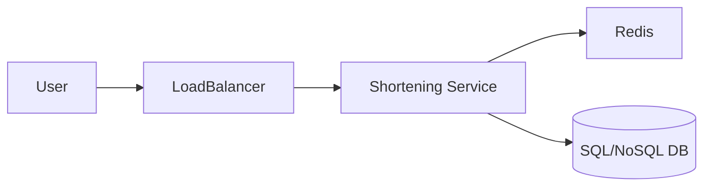

# System Design Thinking: URL Shortener (TinyURL)

A URL shortener is a service that creates short aliases for long URLs. When a user clicks a short URL, the service redirects them to the original long URL.

## 1. Requirements

### Functional Requirements
- **URL Shortening**: Given a long URL, return a shorter and unique URL.
- **URL Redirection**: Given a short URL, redirect the user to the original long URL.
- **Custom Aliases (Optional)**: Allow users to specify a custom short alias.
- **Expiration (Optional)**: Short URLs should have a default expiration time.

### Non-Functional Requirements
- **High Availability**: The redirection service must be highly available.
- **Scalability**: Handle a high volume of shortening and redirection requests.
- **Low Latency**: Redirection should be as fast as possible.
- **Uniqueness**: Short URLs should be unique and not guessable.

## 2. API Design

```rust
pub trait UrlShortener {
    /// Returns a short URL for the given long URL.
    fn shorten(&mut self, long_url: String) -> String;
    
    /// Returns the original long URL for the given short URL.
    fn resolve(&self, short_url: &str) -> Option<String>;
}
```

## 3. High-Level Architecture



1. **Shortening**: API receives long URL -> generates unique ID -> encodes ID to Base62 -> stores (short_url, long_url) in DB and Cache -> returns short URL.
2. **Resolution**: User clicks short URL -> API checks Cache -> if not found, checks DB -> redirects user (301/302).

## 4. Key Design Decisions

### ID Generation
- Use a **Unique ID Generator** (e.g., Snowflake, or a database auto-incrementing ID) to ensure each URL has a unique numeric ID.

### Base62 Encoding
- Convert the numeric ID into a string using Base62 characters: `[0-9, a-z, A-Z]`.
- Example: ID `10,000` -> `2Bi`.
- A 6-character Base62 string provides $62^6 \approx 56.8$ billion unique combinations.

### Redirection Status Codes
- **301 (Permanent Redirect)**: Browsers cache the redirect. Reduces server load but makes tracking difficult.
- **302 (Temporary Redirect)**: Browsers do not cache. Good for analytics and tracking click counts.

## 5. Rust Implementation (Educational)

In the `mod.rs` file, you will implement the **Base62 encoding** logic and a simple in-memory mapping.

### Key Concepts to Practice:
- Number base conversion (Base 10 to Base 62).
- `HashMap` for storing the mappings.
- Thinking about URL validation.
